# 🎬 Live Demo Integration Notes
## SMS Spam Detection with DistilGPT2

**Notebook:** `oaisys_sms_spam.ipynb`  
**Slide Position:** After "How LLMs Actually Work" (Slide 14)  
**Duration:** 4 minutes (can be shortened to 2-3 minutes)

---

## 📋 Demo Overview

### **The Task**
Fine-tune DistilGPT2 for binary classification: SMS spam detection

### **Dataset**
- **Source:** UCI SMS Spam Collection
- **Size:** 5,572 messages
- **Split:** 80% train, 10% validation, 10% test
- **Distribution:** 4,825 ham (86.6%), 747 spam (13.4%)

---

## 🔬 Fine-Tuning Process Explained

### **Visual Overview: The Complete Pipeline**

```mermaid
flowchart TD
    A[📥 Raw Dataset<br/>5,572 SMS messages] --> B[🧹 Data Preprocessing]
    B --> C[📊 Data Split<br/>Train: 4,457<br/>Val: 557<br/>Test: 558]
    
    C --> D[🔤 Tokenization<br/>DistilGPT2 Tokenizer<br/>Max Length: 128]
    
    D --> E[🤖 Load Pre-trained Model<br/>DistilGPT2<br/>+ Classification Head]
    
    E --> F[📈 Baseline Evaluation<br/>Accuracy: 85.7%<br/>F1: 0.00]
    
    F --> G[🎯 Fine-Tuning<br/>3 Epochs<br/>Batch Size: 16<br/>Learning Rate: 5e-5]
    
    G --> H[💾 Save Best Model<br/>Based on F1-score]
    
    H --> I[✅ Final Evaluation<br/>Accuracy: 99.1%<br/>F1: 96.8%]
    
    I --> J[🚀 Inference<br/>Real-time Predictions]
    
    style A fill:#e1f5ff
    style F fill:#ffe1e1
    style I fill:#e1ffe1
    style J fill:#fff4e1
```



### **Key Terminology Explained**

#### **1. Tokenization**
**What it is:** Breaking text into smaller units (tokens) that the model can understand.

**In our demo:**
- Used DistilGPT2 tokenizer
- Max length: 128 tokens per message
- Padding: Added to make all sequences same length
- Example: "Free prize!" → ["Free", " prize", "!"]

**Why it matters:** Models don't understand text directly — they work with numerical representations of tokens.

---

#### **2. Pre-trained Model**
**What it is:** A model already trained on massive amounts of text data (DistilGPT2 trained on web text).

**In our demo:**
- Base model: DistilGPT2 (82M parameters)
- Added: Classification head (2 outputs: ham/spam)
- Status: Knows language patterns, but not spam detection

**Why it matters:** We're not training from scratch — we're adapting existing knowledge to our specific task.

---

#### **3. Classification Head**
**What it is:** Additional layers added on top of the pre-trained model to perform our specific task.

**In our demo:**
- Input: Model's hidden states
- Output: 2 probabilities (ham vs spam)
- Randomly initialized (needs training)

**Why it matters:** This is what we're actually training — teaching the model to map language patterns to spam/ham labels.

---

#### **4. Baseline Evaluation**
**What it is:** Testing the model BEFORE fine-tuning to establish a starting point.

**In our demo:**
- Accuracy: 85.7% (but misleading!)
- F1-score: 0.00 (the real story)
- Model strategy: Guessing "ham" for everything

**Why it matters:** Without a baseline, you can't measure improvement. Our baseline showed the model was useless for spam detection.

---

#### **5. Epochs**
**What it is:** One complete pass through the entire training dataset.

**In our demo:**
- 3 epochs total
- Each epoch: Model sees all 4,457 training examples once
- Total training steps: ~835 steps (4,457 ÷ 16 batch size × 3 epochs)

**Why it matters:** More epochs = more learning, but too many = overfitting. We found 3 was optimal.

---

#### **6. Batch Size**
**What it is:** Number of examples processed together before updating model weights.

**In our demo:**
- Training batch size: 16
- Evaluation batch size: 16
- Total batches per epoch: ~278

**Why it matters:** Larger batches = faster training but more memory. Smaller batches = more updates but slower.

---

#### **7. Learning Rate**
**What it is:** How much to adjust model weights during each update.

**In our demo:**
- Learning rate: 5e-5 (0.00005)
- Warmup steps: 500 (gradual increase)
- Weight decay: 0.01 (regularization)

**Why it matters:** Too high = model doesn't converge. Too low = training takes forever. 5e-5 is standard for fine-tuning.

---

#### **8. Evaluation Metrics**

**Accuracy:** Percentage of correct predictions
- Formula: (Correct predictions) ÷ (Total predictions)
- Our result: 99.1%

**Precision:** Of all spam predictions, how many were actually spam?
- Formula: True Positives ÷ (True Positives + False Positives)
- Our result: 100% (no false positives!)

**Recall:** Of all actual spam, how much did we catch?
- Formula: True Positives ÷ (True Positives + False Negatives)
- Our result: 93.8% (missed 6.2% of spam)

**F1-Score:** Harmonic mean of precision and recall
- Formula: 2 × (Precision × Recall) ÷ (Precision + Recall)
- Our result: 96.8%

**Why it matters:** 
- Accuracy can be misleading (baseline was 85.7% by guessing "ham")
- F1-score balances precision and recall
- 100% precision means zero false positives (critical for spam detection)

---

#### **9. Overfitting vs. Underfitting**

**Overfitting:** Model memorizes training data, performs poorly on new data
- Signs: Training accuracy high, validation accuracy low
- Our demo: No overfitting (validation and test scores similar)

**Underfitting:** Model hasn't learned enough
- Signs: Both training and validation accuracy low
- Our demo: No underfitting (99.1% test accuracy)

**Why it matters:** We achieved the sweet spot — high performance on both training and test data.

---

#### **10. Inference**
**What it is:** Using the trained model to make predictions on new, unseen data.

**In our demo:**
- Input: Raw SMS text
- Process: Tokenize → Model forward pass → Softmax → Prediction
- Output: Label (ham/spam) + Confidence score

**Why it matters:** This is the "showtime" — the model doing its job in production.

---

### **Training Process Step-by-Step**


---

### **What Happens During Fine-Tuning?**

```mermaid
graph LR
    A[Input: SMS Text] --> B[Tokenizer]
    B --> C[Token IDs<br/>[5840, 1671, 342...]]
    C --> D[Embedding Layer<br/>Convert to vectors]
    D --> E[Transformer Layers<br/>12 layers of attention]
    E --> F[Classification Head<br/>2 outputs]
    F --> G[Softmax<br/>Convert to probabilities]
    G --> H[Output:<br/>Ham: 0.01<br/>Spam: 0.99]
    
    style A fill:#e1f5ff
    style E fill:#fff4e1
    style H fill:#e1ffe1
```

**What's being updated:**
- ✅ Classification head weights (most change)
- ✅ Top transformer layers (moderate change)
- ✅ Bottom transformer layers (minimal change)
- ✅ Embedding layer (slight adjustment)

**What stays mostly the same:**
- Language understanding (from pre-training)
- Grammar and syntax knowledge
- General text patterns

---

### **Why This Demo Is Perfect for the Presentation**

1. **Clear Before/After:** 0% F1 → 96.8% F1 (dramatic improvement)
2. **Teaches Behavior:** Not adding facts, learning patterns
3. **Real-World Task:** Everyone understands spam detection
4. **Fast Training:** 10-15 minutes (practical timeframe)
5. **Perfect Precision:** 100% precision is impressive and explainable
6. **Live Inference:** Audience sees it work in real-time

---

## 🎨 How to Use the Diagrams (Optional)

### **Option 1: Show During Demo (Advanced)**
If you want to explain the technical process:

**Pipeline Diagram (Flowchart):**
> "Here's what we did: Started with raw data, preprocessed it, split it, tokenized it, loaded the pre-trained model, evaluated the baseline, fine-tuned for 3 epochs, and achieved 99% accuracy."

**Training Loop (Sequence Diagram):**
> "During each epoch, we feed batches of 16 messages, the model makes predictions, we calculate the error, and update the weights. After each epoch, we evaluate on validation data. The best model gets saved."

**Inference Flow (Graph):**
> "When you send a message, it gets tokenized, converted to vectors, passes through 12 transformer layers, goes through our classification head, and outputs probabilities: 1% ham, 99% spam."

### **Option 2: Skip Diagrams (Recommended)**
Focus on results and live inference instead. The diagrams are in the notes for:
- Your own understanding
- Answering technical questions
- Post-presentation reference

### **Option 3: Show After Demo (Q&A)**
If someone asks "How does the training actually work?", you can:
1. Open this markdown file
2. Show the sequence diagram
3. Walk through the process

---

## 🎯 Key Results to Highlight

### **Before Fine-Tuning (Baseline)**
| Metric | Score | Interpretation |
|--------|-------|----------------|
| **Accuracy** | 85.7% | Guessing "ham" for everything |
| **F1-Score** | 0.00 | Can't detect spam at all |
| **Precision** | 0.00 | No spam predictions |
| **Recall** | 0.00 | Misses all spam |

### **After Fine-Tuning (3 Epochs)**
| Metric | Score | Improvement |
|--------|-------|-------------|
| **Accuracy** | 99.1% | +13.4% |
| **F1-Score** | 96.8% | +96.8% |
| **Precision** | 100% | +100% |
| **Recall** | 93.8% | +93.8% |

---

## 📚 Quick Terminology Reference (For Audience Questions)

Use these simple explanations if audience asks during demo:

| Term | Simple Explanation |
|------|-------------------|
| **Tokenization** | "Breaking text into pieces the model can understand" |
| **Epoch** | "One complete pass through all training data" |
| **Batch Size** | "How many examples we process at once" |
| **Learning Rate** | "How fast the model learns — too fast and it breaks, too slow and it takes forever" |
| **F1-Score** | "A balanced measure that considers both precision and recall" |
| **Precision** | "Of all spam predictions, how many were actually spam?" |
| **Recall** | "Of all actual spam, how much did we catch?" |
| **Overfitting** | "When the model memorizes instead of learning patterns" |
| **Classification Head** | "The part we added to make predictions — like adding a spam detector to a language model" |
| **Baseline** | "Testing before training to see where we started" |

---

## 🎤 Presentation Flow

### **1. Introduction (30 seconds)**
> "Now let's see fine-tuning in action with a live demo."

**[SWITCH TO JUPYTER NOTEBOOK]**

> "The task: Fine-tune DistilGPT2 for SMS spam detection. We have 5,572 SMS messages."

### **2. Baseline Results (45 seconds)**
**[SHOW BASELINE EVALUATION CELL]**

> "First, the baseline. Accuracy 85.7%, but F1-score zero. The model couldn't detect spam at all — just guessing 'ham' for everything."

### **3. Fine-Tuning Process (30 seconds)**
**[SHOW TRAINING CELL - OPTIONAL]**

> "We fine-tuned it. Three epochs. Teaching it the patterns of spam versus legitimate messages."

**Note:** Skip this if short on time.

### **4. After Fine-Tuning Results (1 minute)**
**[SHOW FINE-TUNED EVALUATION CELL]**

> "After fine-tuning, look at these results:"
> - "Accuracy: 99.1%"
> - "F1-score: 96.8% — from zero to nearly perfect"
> - "Precision: 100% — every spam flag is correct"
> - "Recall: 93.8% — catches almost all spam"

### **5. Live Inference Examples (1 minute)**
**[SHOW INFERENCE CELL]**

Run through 2-3 examples:

**Example 1 (Spam):**
> "Congratulations! You've won a $1,000 gift card!"
> **Prediction:** Spam, 99.9% confidence ✓

**Example 2 (Ham):**
> "Hey, just wanted to check in and see how you're doing."
> **Prediction:** Ham, 100% confidence ✓

**Example 3 (Spam):**
> "URGENT! Your mobile number has been selected for a free prize!"
> **Prediction:** Spam, 100% confidence ✓

### **6. Key Insight (30 seconds)**
**[RETURN TO SLIDES]**

> "Fine-tuning transformed a model that couldn't detect spam at all into one with near-perfect precision. This is fine-tuning done right — teaching behavior patterns, not facts."

---

## ⏱️ Timing Options

### **Full Demo (4 minutes)**
- Introduction: 30s
- Baseline: 45s
- Training process: 30s
- Results: 1 min
- Inference: 1 min
- Insight: 30s

### **Shortened Demo (2-3 minutes)**
- Introduction: 30s
- Baseline: 30s
- Skip training visualization
- Results: 45s
- Inference: 45s (2 examples only)
- Insight: 30s

---

## 🎯 Key Messages to Emphasize

1. **Dramatic Improvement**
   - "From zero F1-score to 96.8%"
   - "From can't detect spam to near-perfect precision"

2. **What Fine-Tuning Does**
   - "Teaching patterns, not facts"
   - "Behavior recognition, not knowledge addition"

3. **Perfect Precision**
   - "100% precision means zero false positives"
   - "Every spam flag is accurate"

4. **Practical Application**
   - "This is production-ready"
   - "Real-world spam detection"

---

## 🔧 Technical Setup

### **Pre-Demo Checklist**
- ✅ Notebook fully executed (all cells run)
- ✅ Model trained and saved
- ✅ Inference examples ready
- ✅ Visualization chart generated
- ✅ Notebook in presentation mode (hide code if needed)

### **Cells to Show**
1. **Baseline Evaluation** (Cell 17)
2. **Training** (Cell 18) - Optional
3. **Fine-Tuned Evaluation** (Cell 25)
4. **Inference Examples** (Cell 20)
5. **Metrics Comparison Chart** (Cell 34) - Optional

### **Backup Plan**
If live execution fails:
- Have pre-run screenshots ready
- Show results on slide (already included)
- Continue with voiceover explanation

---

## 💡 Audience Engagement Tips

### **Interactive Elements**
- "Show of hands: Who's tried fine-tuning before?"
- "Can you guess which message is spam?" (before showing prediction)

### **Humor Opportunities**
- "The baseline model is like a spam filter that just gave up"
- "100% precision — it's more confident than I am about anything"

### **Technical Depth**
- Keep it high-level for general audience
- Mention "3 epochs, DistilGPT2" but don't dive deep
- Focus on results, not implementation

---

## 📊 Slide Content (Already Added)

The slide shows:
- Task description
- Side-by-side metrics comparison
- Key insight

**Visual Design:**
- Two-column layout (Baseline vs Fine-Tuned)
- Color-coded (baseline in standard, fine-tuned highlighted)
- Checkmarks on improved metrics
- Professional card design

---

## 🎬 Transition Points

### **From Slides to Notebook**
> "Now let's see fine-tuning in action with a live demo."
> **[ALT+TAB to Jupyter Notebook]**

### **From Notebook to Slides**
> "And that's exactly what fine-tuning is good for."
> **[ALT+TAB back to Slides]**

---

## ⚠️ Common Pitfalls to Avoid

1. **Don't spend too long on code**
   - Show results, not implementation
   - Audience doesn't need to see every line

2. **Don't get stuck on technical details**
   - Keep it high-level
   - Save deep dives for Q&A

3. **Don't let demo fail silently**
   - Test everything beforehand
   - Have backup screenshots

4. **Don't rush the key insight**
   - This is the payoff moment
   - Emphasize the transformation

---

## 📝 Q&A Preparation

### **Expected Questions**

#### **General Questions**

**Q: "How long did training take?"**
A: About 10-15 minutes on a standard GPU. Three epochs on 4,457 training examples. Each epoch took about 3-5 minutes.

**Q: "What about the 6.2% of spam it missed (recall)?"**
A: Great question. Those are likely edge cases — messages that look legitimate but are technically spam. We could improve recall with more training data or by adjusting the classification threshold.

**Q: "Can this work for other languages?"**
A: Yes! You'd need training data in that language, but the same approach works. DistilGPT2 supports multiple languages.

**Q: "What about false positives?"**
A: Zero. That's the beauty of 100% precision. Every message flagged as spam actually is spam. This is critical for spam detection — you don't want to block legitimate messages.

**Q: "How much data do you really need?"**
A: We used ~4,500 training examples. You could probably get good results with 1,000-2,000 high-quality examples for a task like this. Quality matters more than quantity.

---

#### **Technical Questions**

**Q: "What's the difference between epochs and steps?"**
A: An epoch is one complete pass through all training data. Steps are individual batch updates. We had ~278 steps per epoch (4,457 examples ÷ 16 batch size).

**Q: "Why 3 epochs specifically?"**
A: We evaluated after each epoch and found that performance plateaued after epoch 3. More epochs would risk overfitting without improving results.

**Q: "What's a classification head?"**
A: It's a small neural network layer we added on top of DistilGPT2. The base model understands language; the classification head maps that understanding to our specific task (spam vs ham).

**Q: "Why was the baseline F1-score zero?"**
A: The model was predicting "ham" for everything because the dataset is imbalanced (86% ham, 14% spam). High accuracy, but useless for detecting spam. This shows why accuracy alone is misleading.

**Q: "What's the learning rate and why does it matter?"**
A: 5e-5 (0.00005). It controls how much we adjust weights during training. Too high and the model doesn't converge; too low and training takes forever. 5e-5 is standard for fine-tuning pre-trained models.

**Q: "How do you prevent overfitting?"**
A: Several ways:
- Validation set monitoring (evaluate after each epoch)
- Early stopping (stop if validation performance degrades)
- Weight decay (0.01 regularization)
- Not training too many epochs

**Q: "What happens during tokenization?"**
A: Text gets broken into subword units. For example, "Congratulations" might become ["Congrat", "ulations"]. Each token gets a unique ID that the model can process. We set max length to 128 tokens.

**Q: "Why DistilGPT2 instead of GPT-3 or GPT-4?"**
A: Three reasons:
1. Smaller (82M parameters) — faster to fine-tune
2. Open source — we can run it locally
3. Good enough for this task — bigger isn't always better

**Q: "Can you explain precision vs recall?"**
A: Sure! Imagine a spam filter:
- **Precision:** Of all messages you flagged as spam, how many were actually spam? (We got 100%)
- **Recall:** Of all actual spam messages, how many did you catch? (We got 93.8%)
- **Trade-off:** You can catch all spam (100% recall) but flag legitimate messages too (low precision), or be very careful (100% precision) but miss some spam (lower recall).

**Q: "What's the difference between fine-tuning and training from scratch?"**
A: Fine-tuning starts with a pre-trained model that already understands language. We're just adapting it to our task. Training from scratch would require millions of examples and weeks of compute time. Fine-tuning took 15 minutes.

---

## ✅ Success Criteria

Demo is successful if audience understands:
1. ✅ Fine-tuning dramatically improves task-specific performance
2. ✅ It teaches patterns/behavior, not facts
3. ✅ Results are measurable and impressive
4. ✅ This is a practical, real-world application

---

**Demo Status:** ✅ READY  
**Backup Materials:** ✅ PREPARED  
**Timing:** ✅ FLEXIBLE (2-4 minutes)
